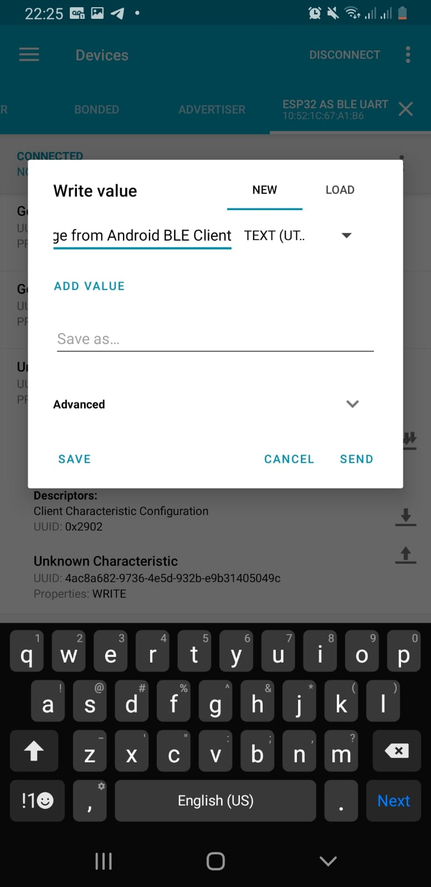
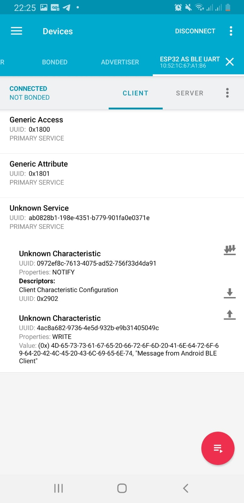
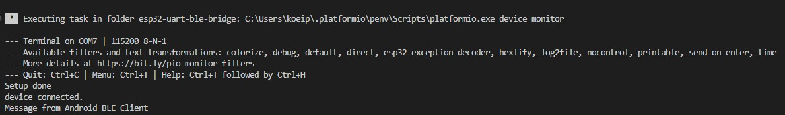

# ESP32: UART - BLE Bridge

This is a simple project which uses and ESP32 to act as a bridge to communicate messages received from a BLE Client (Android App) sender, to a UART connected device (Arduino) receiver. This does not provide the code for the Arduino in which will be connected to the ESP32. For the Android app, it is recommended to install the app [nRF Connect](https://play.google.com/store/apps/details?id=no.nordicsemi.android.mcp), and will act as the BLE Client.

> Note: Currently this code only works one way, which is from the BLE Client (Android App) to this BLE Server (ESP32). This can though be extended by adding a fixing the TX characteristic within this BLE Server, to then provide a way to communicate back

Communication Diagram:

`Arduino --(UART)-- ESP32 --(BLE)-- Android`

## Getting Started
- Download [nRF Connect](https://play.google.com/store/apps/details?id=no.nordicsemi.android.mcp) on your Android phone
- Install [VSCode](https://code.visualstudio.com/download)
- Install PlatformIO (PIO) Extension in VSCode
    - Go to `Extensions` on the left side bar, search for PlatformIO
- `git clone https://github.com/royyandzakiy/esp32-uart-ble-bridge.git` Clone the repository 
- `cd esp32-uart-ble-bridge` Go into the downloaded/cloned repo folder
- Open the `platform.ini` file, let PIO to load and install the required platform (espressif32)
    - This will take some time, because (if not yet) you need to download the whole choice of platform, in this case is `espressif32`
    - After the PIO Task of Downloading the platform is done, usually it does another PIO task, which is to "Configure project". Just wait for another while, after done, continue to the next step
- Build, Upload, Monitor
    

## Communicate
- Send Message from nRF Connect (Android BLE Client) to ESP32

images

